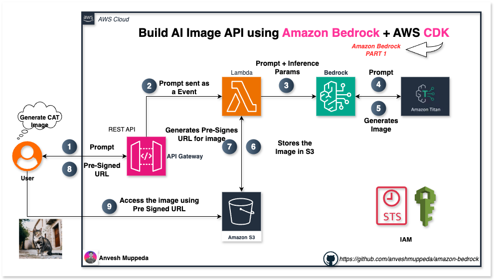

# Building an AI-Powered Image Generation API with Amazon Bedrock and AWS CDK



## Introduction

In this tutorial, we'll build a serverless image generation API using Amazon Bedrock's Titan Image Generator G1 model. Our solution combines several AWS services to create a scalable, cost-effective image generation service that can be easily integrated into applications.

**What we'll build:**
- A REST API that generates images from text prompts
- Serverless architecture using AWS Lambda
- Automatic image storage in S3 with presigned URLs
- Infrastructure as Code using AWS CDK

## Architecture Overview

Our solution uses four main AWS services:

1. **Amazon Bedrock** - AI service providing the Titan Image Generator G1 model
2. **AWS Lambda** - Serverless compute for processing requests
3. **API Gateway** - REST API endpoint for client requests
4. **Amazon S3** - Storage for generated images

The flow works as follows:
1. Client sends a POST/GET request with a text prompt
2. API Gateway forwards the request to Lambda
3. Lambda calls Bedrock to generate the image
4. Generated image is stored in S3
5. A presigned URL is returned to the client

## Project Structure

```
amazon-bedrock/
└── 02-image-generation
    └── image-generation/
        ├── app.py                          # CDK app entry point
        ├── lambda/
        │   └── index.py                   # Lambda function code
        └── image_generation/
            └── image_generation_stack.py  # CDK stack definition
```

## Code Review and Analysis

### CDK Stack ([image_generation_stack.py](./image-generation/image_generation/image_generation_stack.py))

Let's break down the main components:

#### S3 Bucket Configuration
```python
image_source_bucket = s3.Bucket(
    self, 
    "ImageSourceBucket",
    bucket_name="amazon-bedrock-image-source-bucket-002",
    removal_policy=RemovalPolicy.DESTROY,
    auto_delete_objects=True
)
```

**Key Features:**
- Configured for easy cleanup during development
- Auto-deletes objects when stack is destroyed
- Acts as storage for generated images

#### Lambda Function Setup
```python
image_generator_function = _lambda.Function(
    self, "ImageGeneratorFunction",
    runtime=_lambda.Runtime.PYTHON_3_13,
    function_name="ImageGeneratorUsingTitanG1",
    description="Generates images using Amazon Titan Image Generator G1 model on demand.",
    handler="index.index", 
    code=_lambda.Code.from_asset("lambda"),
    timeout=Duration.seconds(300),
    environment={
        "IMAGE_SOURCE_BUCKET": image_source_bucket.bucket_name
    }
)
```

**Key Features:**
- 5-minute timeout for image generation
- Environment variable for S3 bucket name
- Python 3.13 runtime

#### IAM Permissions
The stack grants comprehensive Bedrock permissions:
- `bedrock:InvokeModel` - Core permission for image generation
- `bedrock:GetFoundationModel` - Access model information
- Additional permissions for advanced features

#### API Gateway Configuration
```python
api = apigw.RestApi(
    self, "ImageGenerationApi",
    rest_api_name="Image Generation Service",
    description="This service generates images using Amazon Bedrock Titan Image Generator.",
    default_cors_preflight_options=apigw.CorsOptions(
        allow_origins=apigw.Cors.ALL_ORIGINS,
        allow_methods=apigw.Cors.ALL_METHODS,
        allow_headers=["Content-Type", "X-Amz-Date", "Authorization", "X-Api-Key"]
    )
)
```

**Key Features:**
- CORS enabled for web applications
- RESTful API design
- Supports both GET and POST methods

### Lambda Function ([lambda/index.py](./image-generation/lambda/index.py))

#### Image Generation Logic
```python
def generate_image(model_id, body):
    bedrock = boto3.client(service_name='bedrock-runtime')
    
    response = bedrock.invoke_model(
        body=body, modelId=model_id, accept=accept, contentType=content_type
    )
    
    response_body = json.loads(response.get("body").read())
    base64_image = response_body.get("images")[0]
    image_bytes = base64.b64decode(base64_image)
    
    return image_bytes
```

**Key Features:**
- Uses Bedrock Runtime client
- Handles base64 image decoding
- Error handling for failed generations

#### Request Processing
The main handler processes requests and returns presigned URLs for easy image access.

## Deployment Guide

### Prerequisites

1. **AWS CLI configured** with appropriate permissions
2. **AWS CDK installed**:
   ```bash
   npm install -g aws-cdk
   ```
3. **Python 3.8+** installed
4. **Bedrock model access** - Ensure Titan Image Generator G1 is enabled in your AWS region

### Step-by-Step Deployment

1. **Clone and navigate to source code**:
   ```bash
   git clone https://github.com/anveshmuppeda/amazon-bedrock.git
   cd amazon-bedrock/02-image-generation/image-generation
   ```

2. Create a virtualenv on MacOS and Linux:
    ```bash
    $ python3 -m venv .venv
    ```
3. Activate your virtualenv.
    ```
    $ source .venv/bin/activate
    ```

4. Once the virtualenv is activated, you can install the required dependencies.
    ```
    $ pip install -r requirements.txt
    ```

5. **Bootstrap CDK** (first time only):
   ```bash
   cdk bootstrap
   ```

6. At this point you can now synthesize the CloudFormation template for this code.

    ```
    $ cdk synth
    ```

7. **Deploy the stack**:
   ```bash
   cdk deploy
   ```

8. **Note the API Gateway URL** from the deployment output.

### Enabling Bedrock Models

Before testing, ensure you have access to the Titan Image Generator G1 model:

1. Go to Amazon Bedrock console
2. Navigate to "Model access" in the left sidebar
3. Click "Enable specific models"
4. Find and enable "Titan Image Generator G1"
5. Wait for approval (usually immediate for Titan models)

## Testing with Postman

### Method 1: GET Request

1. **Create a new GET request** in Postman
2. **URL**: `https://your-api-id.execute-api.region.amazonaws.com/prod/generate-image`
3. **Add query parameter**:
   - Key: `prompt`
   - Value: `A beautiful sunset over mountains`

### Expected Response

Both methods should return:
```json
{
  "statusCode": 200,
  "body": "https://amazon-bedrock-image-source-bucket-002.s3.amazonaws.com/imageNameYYYY-MM-DD-HH-MM-SS.png?AWSAccessKeyId=..."
}
```

The response contains a presigned URL that's valid for 1 hour, allowing direct access to the generated image.

### Testing Different Prompts

Try these sample prompts to test various capabilities:

1. **Simple objects**: "A red coffee cup on a wooden table"
2. **Landscapes**: "A serene lake surrounded by pine trees at dawn"
3. **Abstract concepts**: "Digital art representing the concept of time"
4. **Detailed scenes**: "A Victorian-era library with leather-bound books and a fireplace"

## Advanced Configuration Options

### Image Generation Parameters

You can modify the Lambda function to accept additional parameters:

```python
body = json.dumps({
    "taskType": "TEXT_IMAGE",
    "textToImageParams": {
        "text": prompt
    },
    "imageGenerationConfig": {
        "numberOfImages": 1,
        "height": 1024,      # 512, 768, 1024
        "width": 1024,       # 512, 768, 1024
        "cfgScale": 8.0,     # 1.1 to 10.0
        "seed": 0           # 0 to 2147483647
    }
})
```

**Parameters explained:**
- **height/width**: Image dimensions (512x512, 768x768, or 1024x1024)
- **cfgScale**: How closely the model follows the prompt (higher = more adherent)
- **seed**: For reproducible results (same seed + prompt = same image)

### Security Enhancements

For production use, consider:

1. **API Key authentication**
2. **Rate limiting** to prevent abuse
3. **Input sanitization** for prompts
4. **CloudWatch monitoring** and alerts
5. **VPC endpoints** for enhanced security

### Cost Optimization

1. **S3 Lifecycle policies** to automatically delete old images
2. **Lambda provisioned concurrency** for consistent performance
3. **CloudFront distribution** for global image delivery

## Troubleshooting Common Issues

### 1. "Model not found" Error
- Ensure Titan Image Generator G1 is enabled in Bedrock
- Check the correct model ID: `amazon.titan-image-generator-v1`

### 2. Permission Denied
- Verify IAM permissions for Bedrock access
- Check Lambda execution role permissions

### 3. Timeout Issues
- Increase Lambda timeout (currently 5 minutes)
- Monitor CloudWatch logs for performance insights

### 4. CORS Errors
- Verify CORS configuration in API Gateway
- Check preflight request handling

## Monitoring and Logging

### CloudWatch Integration

The solution automatically integrates with CloudWatch:

- **Lambda logs**: Function execution details
- **API Gateway logs**: Request/response tracking
- **Bedrock metrics**: Model invocation statistics

### Key Metrics to Monitor

1. **Lambda duration**: Track image generation time
2. **Error rates**: Monitor failed requests
3. **S3 storage**: Track image storage costs
4. **API Gateway requests**: Monitor usage patterns

## Conclusion

This serverless image generation API demonstrates the power of combining AWS services with AI capabilities. The solution is:

- **Scalable**: Automatically handles varying loads
- **Cost-effective**: Pay only for what you use
- **Maintainable**: Infrastructure as Code with CDK
- **Extensible**: Easy to add new features and models

The architecture serves as a solid foundation that can be extended with additional features like batch processing, different AI models, or advanced image manipulation capabilities.

### Next Steps

1. **Add authentication** for production use
2. **Implement caching** for repeated prompts
3. **Add support for multiple models** (Stability AI, etc.)
4. **Create a web frontend** for easier testing
5. **Add image metadata storage** in DynamoDB

This project showcases how modern cloud services can quickly deliver AI capabilities to applications, making advanced image generation accessible through simple API calls.