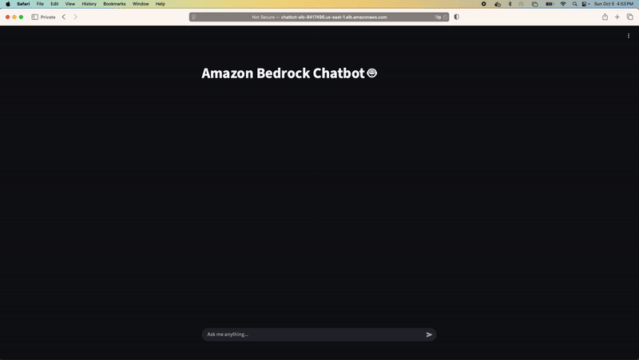
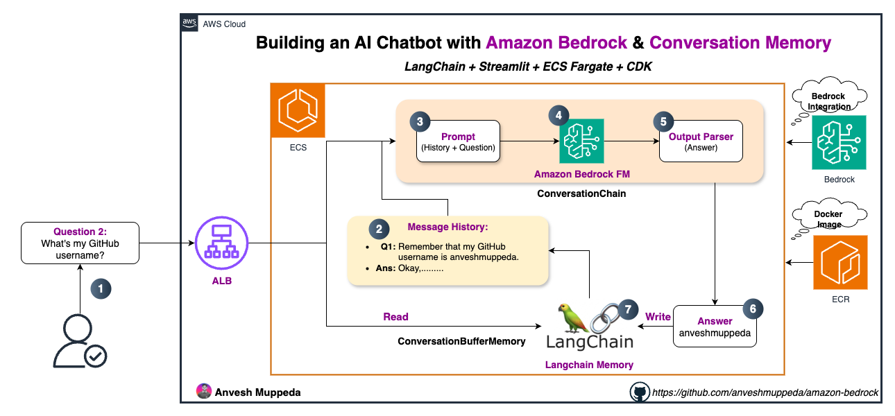

# 🤖 Amazon Bedrock Chatbot with Memory



Build an intelligent chatbot with conversation memory using Amazon Bedrock, LangChain, and Streamlit. Deploy it on AWS ECS with complete infrastructure as code.

## 🎯 What You'll Build

- **Intelligent Chatbot** with conversation memory and context awareness
- **Streamlit Web Interface** for interactive chat experience
- **AWS ECS Deployment** with Application Load Balancer
- **Conversation Memory** using LangChain's ConversationSummaryBufferMemory
- **Production-Ready Infrastructure** with CDK

## 🏗️ Architecture Overview



```
┌─────────────────┐    ┌─────────────────┐    ┌─────────────────┐
│   User Browser  │───►│  Application    │───►│   ECS Fargate   │
│                 │    │  Load Balancer  │    │   Container     │
└─────────────────┘    └─────────────────┘    └─────────────────┘
                                                        │
                                                        ▼
                                               ┌─────────────────┐
                                               │  Amazon Bedrock │
                                               │  (Claude/Nova)  │
                                               └─────────────────┘
```

## 📋 Table of Contents

- [Prerequisites](#-prerequisites)
- [Project Structure](#-project-structure)
- [Implementation Details](#-implementation-details)
- [Step-by-Step Guide](#-step-by-step-guide)
- [Local Development](#-local-development)
- [AWS Deployment](#-aws-deployment)
- [Testing](#-testing)
- [Troubleshooting](#-troubleshooting)
- [Cost Optimization](#-cost-optimization)

## ✅ Prerequisites

### Required Tools
```bash
# AWS CLI v2
aws --version

# AWS CDK
npm install -g aws-cdk
cdk --version

# Python 3.11+
python --version

# Docker
docker --version
```

### AWS Account Setup
- ✅ AWS Account with appropriate permissions
- ✅ AWS CLI configured with credentials
- ✅ Amazon Bedrock model access enabled (Claude or Nova models)
- ✅ ECR repository permissions
- ✅ ECS and VPC permissions

### Enable Bedrock Models
1. Navigate to Amazon Bedrock Console
2. Go to "Model access" → "Enable specific models"
3. Enable: `anthropic.claude-3-sonnet-20240229-v1:0` or `amazon.nova-pro-v1:0`
4. Wait for approval (usually immediate)

## 📁 Project Structure

```
05-chatbot/
├── source/                     # Application source code
│   ├── chatbot_backend.py      # Backend logic with LangChain
│   └── chatbot_frontend.py     # Streamlit UI
├── chatbot/                    # CDK infrastructure
│   ├── app.py                  # CDK app entry point
│   └── chatbot/
│       ├── chatbot_ecr_stack.py    # ECR repository
│       └── chatbot_ecs_stack.py    # ECS service & ALB
├── Dockerfile                  # Container configuration
├── docker-compose.yml          # Local development
├── requirements.txt            # Python dependencies
└── README.md                   # This guide
```

## 🔧 Implementation Details

### Backend Architecture (`chatbot_backend.py`)

#### 1. **Bedrock Client Initialization**
```python
# Singleton pattern for efficient resource usage
_bedrock_llm = None

def get_bedrock_client():
    global _bedrock_llm
    if _bedrock_llm is None:
        _bedrock_llm = ChatBedrockConverse(
            region_name='us-east-1',
            model='amazon.nova-pro-v1:0',
            temperature=0.1,      # Low randomness for consistent responses
            max_tokens=1000       # Reasonable response length
        )
    return _bedrock_llm
```

#### 2. **Conversation Memory Management**
```python
def create_chat_memory():
    return ConversationSummaryBufferMemory(
        llm=get_bedrock_client(), 
        max_token_limit=2000      # Prevents context overflow
    )
```

**Memory Flow:**
1. **Initial State**: Empty memory buffer
2. **User Input**: Added to conversation history
3. **AI Response**: Generated with full context
4. **Memory Update**: Conversation stored with automatic summarization
5. **Context Management**: Old conversations summarized when token limit reached

#### 3. **Response Generation**
```python
def get_ai_response(user_input, chat_memory):
    conversation_chain = ConversationChain(
        llm=get_bedrock_client(), 
        memory=chat_memory, 
        verbose=True              # Debug logging
    )
    return conversation_chain.invoke(user_input)['response']
```

### Frontend Architecture (`chatbot_frontend.py`)

#### 1. **Session State Management**
```python
# Initialize persistent memory across page reloads
if 'chat_memory' not in st.session_state: 
    st.session_state.chat_memory = backend.create_chat_memory()

# Initialize chat history for UI display
if 'chat_history' not in st.session_state:
    st.session_state.chat_history = []
```

#### 2. **Chat Flow Process**

**Step-by-Step User Interaction:**

1. **User Input Capture**
   ```python
   user_input = st.chat_input("Ask me anything...")
   ```

2. **Display User Message**
   ```python
   with st.chat_message("user"): 
       st.markdown(user_input)
   ```

3. **Store in Session History**
   ```python
   st.session_state.chat_history.append({
       "role": "user", 
       "text": user_input
   })
   ```

4. **Generate AI Response**
   ```python
   ai_response = backend.get_ai_response(
       user_input, 
       st.session_state.chat_memory
   )
   ```

5. **Display AI Response**
   ```python
   with st.chat_message("assistant"): 
       st.markdown(ai_response)
   ```

6. **Update Session History**
   ```python
   st.session_state.chat_history.append({
       "role": "assistant", 
       "text": ai_response
   })
   ```

### Infrastructure Architecture

#### ECR Stack (`chatbot_ecr_stack.py`)
- **Purpose**: Container registry for Docker images
- **Components**: ECR Repository with lifecycle policies

#### ECS Stack (`chatbot_ecs_stack.py`)
- **VPC**: Multi-AZ setup with public/private subnets
- **ECS Cluster**: Fargate-based container orchestration
- **Task Definition**: Container specs with Bedrock permissions
- **Application Load Balancer**: Internet-facing with health checks
- **Security Groups**: Controlled network access

## 🚀 Step-by-Step Guide

### Phase 1: Local Development Setup

#### 1. Clone and Setup Environment
```bash
# Clone repository
git clone https://github.com/anveshmuppeda/amazon-bedrock.git
cd amazon-bedrock/05-chatbot

# Create virtual environment
python -m venv chatbot-env
source chatbot-env/bin/activate  # Windows: chatbot-env\Scripts\activate

# Install dependencies
pip install -r requirements.txt
```

#### 2. Configure AWS Credentials
```bash
# Configure AWS CLI
aws configure
# Enter: Access Key, Secret Key, Region (us-east-1), Output format (json)

# Verify configuration
aws sts get-caller-identity
```

#### 3. Test Bedrock Access
```bash
# List available models
aws bedrock list-foundation-models --region us-east-1

# Test model access
aws bedrock invoke-model \
    --model-id "amazon.nova-pro-v1:0" \
    --body '{"messages":[{"role":"user","content":[{"text":"Hello"}]}],"inferenceConfig":{"maxTokens":100}}' \
    --cli-binary-format raw-in-base64-out \
    --region us-east-1 \
    output.json
```

### Phase 2: Local Testing

#### 1. Run with Docker Compose (Recommended)
```bash
# Start the application
docker-compose up --build

# Access application
open http://localhost:8501
```

#### 2. Run Locally (Development)
```bash
# Navigate to source directory
cd source

# Set environment variables
export AWS_DEFAULT_REGION=us-east-1
export BEDROCK_MODEL_ID=amazon.nova-pro-v1:0

# Run Streamlit
streamlit run chatbot_frontend.py
```

#### 3. Test Conversation Memory

**Test Scenario:**
1. **First Message**: "My name is John and I like pizza"
2. **Second Message**: "What's my name?"
3. **Expected Response**: AI should remember "John"
4. **Third Message**: "What do I like to eat?"
5. **Expected Response**: AI should remember "pizza"

### Phase 3: AWS Deployment

#### 1. Bootstrap CDK (First Time Only)
```bash
cd chatbot
cdk bootstrap aws://$(aws sts get-caller-identity --query Account --output text)/us-east-1
```

#### 2. Deploy ECR Repository
```bash
# Deploy ECR stack
cdk deploy ChatbotEcrStack

# Note the ECR repository URI from output
```

#### 3. Build and Push Docker Image
```bash
# Get ECR login token
aws ecr get-login-password --region us-east-1 | \
docker login --username AWS --password-stdin \
$(aws sts get-caller-identity --query Account --output text).dkr.ecr.us-east-1.amazonaws.com

# Build for Linux/AMD64 (required for ECS)
docker build --platform linux/amd64 -t chatbot-ecr-repository:latest .

# Tag for ECR
docker tag chatbot-ecr-repository:latest \
$(aws sts get-caller-identity --query Account --output text).dkr.ecr.us-east-1.amazonaws.com/chatbot-ecr-repository:latest

# Push to ECR
docker push \
$(aws sts get-caller-identity --query Account --output text).dkr.ecr.us-east-1.amazonaws.com/chatbot-ecr-repository:latest
```

#### 4. Deploy ECS Infrastructure
```bash
# Deploy ECS stack
cdk deploy ChatbotEcsStack

# Note the LoadBalancer DNS from output
```

#### 5. Access Deployed Application
```bash
# Get ALB DNS name
aws elbv2 describe-load-balancers \
    --names chatbot-alb \
    --query 'LoadBalancers[0].DNSName' \
    --output text

# Access application
open http://[ALB-DNS-NAME]
```

## 🧪 Testing

### Functional Tests

#### 1. **Memory Persistence Test**
```
User: "Remember that I work as a software engineer at AWS"
AI: "I'll remember that you work as a software engineer at AWS."

User: "What's my job?"
AI: "You work as a software engineer at AWS."
```

#### 2. **Context Awareness Test**
```
User: "I have a meeting at 3 PM about the new project"
AI: "Got it, you have a meeting at 3 PM about the new project."

User: "What time is my meeting?"
AI: "Your meeting is at 3 PM."

User: "What's it about?"
AI: "It's about the new project."
```

#### 3. **Long Conversation Test**
- Send 10+ messages to test memory summarization
- Verify older context is summarized but key information retained

### Performance Tests

#### 1. **Response Time**
```bash
# Test API response time
curl -w "@curl-format.txt" -s -o /dev/null http://[ALB-DNS]/
```

#### 2. **Concurrent Users**
```bash
# Simulate multiple users
for i in {1..5}; do
    curl -X POST http://[ALB-DNS]/ &
done
```

### Health Checks

#### 1. **Container Health**
```bash
# Check container status
docker ps

# Check health endpoint
curl http://localhost:8501/_stcore/health
```

#### 2. **ECS Service Health**
```bash
# Check ECS service status
aws ecs describe-services \
    --cluster chatbot-ecs-cluster \
    --services chatbot-ecs-service
```

## 🔧 Troubleshooting

### Common Issues

#### 1. **Bedrock Access Denied**
```
Error: AccessDeniedException
Solution: Enable model access in Bedrock console
```

#### 2. **Memory Issues**
```
Error: Token limit exceeded
Solution: Reduce max_token_limit in ConversationSummaryBufferMemory
```

#### 3. **Container Won't Start**
```bash
# Check logs
docker logs [container-id]

# Common issues:
# - Missing AWS credentials
# - Wrong model ID
# - Network connectivity
```

#### 4. **ECS Task Failures**
```bash
# Check ECS logs
aws logs get-log-events \
    --log-group-name "/chatbot/logs" \
    --log-stream-name [stream-name]
```

### Debug Commands

```bash
# Test Bedrock connectivity
aws bedrock list-foundation-models --region us-east-1

# Check ECR repository
aws ecr describe-repositories --repository-names chatbot-ecr-repository

# Verify ECS service
aws ecs list-services --cluster chatbot-ecs-cluster

# Check ALB health
aws elbv2 describe-target-health --target-group-arn [target-group-arn]
```

## 💰 Cost Optimization

### Estimated Costs (Monthly)

| Component | Cost | Usage |
|-----------|------|-------|
| **ECS Fargate** | ~$15 | 1 task, 0.5 vCPU, 1GB RAM |
| **Application Load Balancer** | ~$18 | Standard ALB |
| **Bedrock API Calls** | ~$5 | 1000 requests/month |
| **CloudWatch Logs** | ~$1 | Standard logging |
| **Total** | **~$39/month** | Light usage |

### Cost Reduction Tips

1. **Auto Scaling**: Configure ECS auto-scaling based on CPU/memory
2. **Spot Instances**: Use Fargate Spot for non-production
3. **Log Retention**: Set shorter CloudWatch log retention
4. **Resource Right-Sizing**: Monitor and adjust CPU/memory allocation

### Cleanup Resources

```bash
# Destroy ECS stack
cdk destroy ChatbotEcsStack

# Destroy ECR stack (after confirming no images needed)
cdk destroy ChatbotEcrStack

# Verify cleanup
aws ecs list-clusters
aws ecr describe-repositories
```

## 🎯 Key Learning Outcomes

After completing this guide, you'll understand:

- ✅ **Conversation Memory**: How LangChain manages chat context
- ✅ **Bedrock Integration**: Direct API calls vs LangChain abstraction
- ✅ **Streamlit State Management**: Session persistence across interactions
- ✅ **Container Orchestration**: ECS Fargate deployment patterns
- ✅ **Load Balancing**: ALB configuration for web applications
- ✅ **Infrastructure as Code**: CDK best practices for AI applications

## 🔗 Related Guides

- **[04-generate-embedding](../04-generate-embedding/)**: Text embeddings and vector operations
- **[06-rag-server](../06-rag-server/)**: Document-based Q&A with RAG
- **[02-image-generation](../02-image-generation/)**: AI image generation

## 📚 Additional Resources

- [Amazon Bedrock Documentation](https://docs.aws.amazon.com/bedrock/)
- [LangChain Memory Guide](https://python.langchain.com/docs/modules/memory/)
- [Streamlit Documentation](https://docs.streamlit.io/)
- [AWS ECS Best Practices](https://docs.aws.amazon.com/AmazonECS/latest/bestpracticesguide/)

---

**Ready to build your intelligent chatbot?** Start with [local development](#phase-1-local-development-setup) and work your way up to production deployment! 🚀